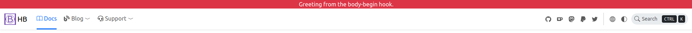

You may want to include custom HTML markup to extend functionalities, that's quit easy to do that with HugoPress built-in hooks and HB custom hooks.

<!--more-->

Let's get started with a simple example, which displays a greeting message on the top of page.



## Choose the Right Hook

- [HugoPress built-in hooks](https://hugomods.com/en/docs/hugopress/#hooks).
- [Header's hooks]().
- [Footer's hooks]().
- [Blog's hooks]().
- [Docs's hooks]().
- You can find more on our documentation.

In this example, the `body-begin` hook is the hook we're looking for.

## Configuration

And then configure the hook.

{}
{}
{}

If everything is OK, Hugo'll complaint about _partial not found_.

{}
{}
It's recommended to use `hb-custom` as the HugoPress module name, to avoid conflicting with other HugoPress modules.
{}
{}


Since the example HTML markup doesn't contains dynamic content, mark it as `cacheable` to improve build performance.


## Create Partial

It's time to create the partial for including custom HTML. The partial name is related to the module and hook name.


```html
{}
```


You're able to access Page variables via `.Page`, please don't forgot disabling the `cacheable` for dynamic data.
See also [Hooks Context](https://hugomods.com/en/docs/hugopress/#hooks-context).

That's it, now the greeting message will appear at the top of page.
