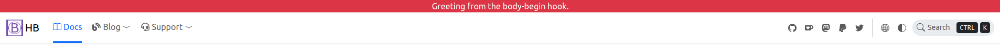

你可能希望包含自定义 HTML 标记，以扩展功能，这对于 HugoPress 内置钩子和 HB 自定义钩子来说小菜一碟。

<!--more-->

让我们从一个简单的示例开始，该示例在页面顶部显示一条问候消息。



## 选择正确的钩子

- [HugoPress 内置钩子](https://hugomods.com/en/docs/hugopress/#hooks)。
- [页头钩子]()。
- [页尾钩子]()。
- [博客钩子]()。
- [文档钩子]()。
- 更多钩子可以通过我们文档找到。

本例中，`body-begin` 正是我们需要的钩子。

## 配置

然后配置钩子。

{}
{}
{}

如果一切正常，Hugo 将抱怨找不到模板：_partial not found_。

{}
{}
推荐使用 `hb-custom` 作为 HugoPress 的模块名称，以避免和其他模块冲突。
{}
{}

{}
因为示例 HTML 并不包含动态内容，将其标记为 `cacheable`，以提升构建性能。
{}

## 创建模板

紧接着创建模板以包含 HTML，模板名称和模块、钩子名称相关。

{}
```html
{}
```
{}

你可以通过 `.Page` 获取页面参数，若包含动态内容，请别忘记禁用 `cacheable`。
详情请参阅 [Hooks Context](https://hugomods.com/en/docs/hugopress/#hooks-context)。

就这样，现在问候语将出现在页面的顶部。
