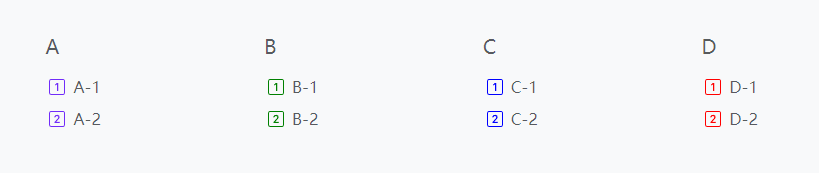

This article describes how to configure the footer's menus.

<!--more-->

As the image shown, the footer's menus has two levels.

## Menus Set Identifier

The `footer` is taken as the footer's menus set identifier.

## Footer Menu Entry Params

| Parameter     |  Type   | Description                                                     |
| :------------ | :-----: | :-------------------------------------------------------------- |
| `icon`        | object  | The icon parameters.                                            |
| `icon.vendor` | string  | The icon's vendor，required.                                    |
| `icon.name`   | string  | The icon's name, required.                                      |
| `icon.color`  | string  | The icon's color.                                               |

See also [Menus Configuration]().

## Example


{}


The example above use the Bootstrap icons, if the icons do not show up, please check if you've installed/imported the following module.


module:
  imports:
    - path: github.com/hugomods/icons/vendors/bootstrap


The Bootstrap icons and other icons vendors can be found on [Hugo Icons Module](https://hugomods.com/en/icons).
