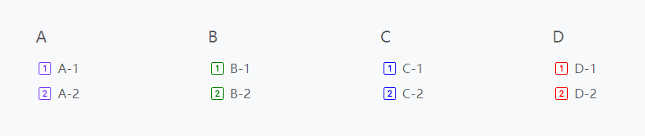

本文将描述如何配置页尾菜单。

<!--more-->

如图所示，页尾菜单具有两级层次。

## 菜单集标识

页尾菜单集标识为 `footer`。

## 页尾菜单项参数

| Parameter        |  Type  | Description        |
| :--------------- | :----: | :----------------- |
| `icon`           | object | 图标参数。         |
| `icon.vendor`    | string | 图标供应商，必填。 |
| `icon.name`      | string | 图标名称，必填。   |
| `icon.color`     | string | 图标颜色。         |
| `icon.className` | string | 图标 CSS 类名。    |

详情请参阅[菜单配置]()。

## Example


{}


上述例子实用 Bootstrap 图标，你也可以实用其他[图标](https://hugomods.com/en/icons)，比如 Font Awesome、Feather、Tabler、Simple 等。
