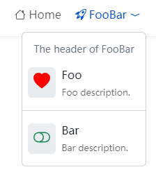

本文将介绍如何配置页头菜单。

<!--more-->


页头菜单最大的深度为两级。


## 菜单集标识

页头菜单集标识为 `main`。

## 页头菜单项参数

| Parameter        |  Type   | Description                        |
| :--------------- | :-----: | :--------------------------------- |
| `header`         | string  | 下拉菜单的标题，只作用于顶级菜单。 |
| `divider`        | boolean | 为 `true` 时，作为分隔符显示。     |
| `description`    | string  | 子菜单的描述。                     |
| `icon`           | object  | 图标参数。                         |
| `icon.vendor`    | string  | 图标供应商，必填。                 |
| `icon.name`      | string  | 图标名称，必填。                   |
| `icon.color`     | string  | 图标颜色。                         |
| `icon.className` | string  | 图标 CSS 类名。                    |

See also [Menus Configuration]().

## Example


{}


The example above use the Bootstrap icons, you can use other [icons vendors](https://hugomods.com/en/icons), such as Font Awesome, Feather, Tabler, Simple icons and so on.
