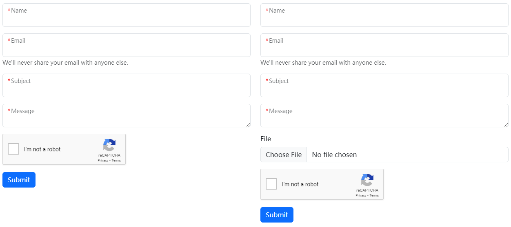

該模塊內置了一個佈局和短代碼，以生成聯繫表單，其兼容大部分表單服務後端。

<!--more-->

{}

## 站點參數

{}


{}


## 已知兼容的表單後端

按字母排序，請隨意於[這裏](https://github.com/hbstack/site/edit/main/data/contact-form-backends.toml)添加兼容的後端。



## 使用方法

可通過多種方式生成聯繫表單。

### 使用佈局生成聯繫表單

該模塊提供了一個內置的佈局 - `contact`, 你可以簡單地創建一個聯繫表單頁面。

{}
{}
{}

你還可以使用任意不同於 `/contact` 的自定義路徑，你只需要於前言中設置 `layout` 爲 `contact`。以 `/contact-us/` 爲例。

{}
{}
{}

### 通過短代碼生成聯繫表單

該模塊還提供了一個短代碼 `hb/contact` 以生成聯繫表單，該短代碼接受上述相同的[參數](#站點參數)以修改站點參數配置。

```markdown
<div class="row row-cols-1 row-cols-lg-2">
  <div class="col">
    
  </div>
  <div class="col">
    
  </div>
</div>
```


