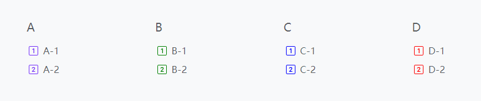

This article describes how to configure the footer's menus.

<!--more-->

As the image shown, the footer's menus has two levels.

## Menus Set Identifier

The `footer` is taken as the footer's menus set identifier.

## Footer Menu Entry Params

| Parameter        |  Type  | Description                  |
| :--------------- | :----: | :--------------------------- |
| `icon`           | object | The icon parameters.         |
| `icon.vendor`    | string | The icon's vendor, required. |
| `icon.name`      | string | The icon's name, required.   |
| `icon.color`     | string | The icon's color.            |
| `icon.className` | string | The icon's CSS class name.   |

See also [Menus Configuration]() and [Icons Configuration]().

## Example


{}


The example above use the Bootstrap icons, you can use other [icons vendors](https://hugomods.com/en/icons), such as Font Awesome, Feather, Tabler, Simple icons and so on.
