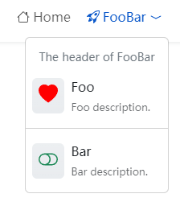

本文將介紹如何配置頁頭菜單。

<!--more-->


頁頭菜單最大的深度爲兩級。


## 菜單集標識

頁頭菜單集標識爲 `main`。

## 頁頭菜單項參數

| Parameter        |  Type   | Description                        |
| :--------------- | :-----: | :--------------------------------- |
| `header`         | string  | 下拉菜單的標題，只作用於頂級菜單。 |
| `divider`        | boolean | 爲 `true` 時，作爲分隔符顯示。     |
| `description`    | string  | 子菜單的描述。                     |
| `icon`           | object  | 圖標參數。                         |
| `icon.vendor`    | string  | 圖標供應商，必填。                 |
| `icon.name`      | string  | 圖標名稱，必填。                   |
| `icon.color`     | string  | 圖標顏色。                         |
| `icon.className` | string  | 圖標 CSS 類名。                    |

詳情請參閱[菜單配置]()。

## Example


{}


上述例子實用 Bootstrap 圖標，你也可以使用其他[圖標](https://hugomods.com/en/icons)，比如 Font Awesome、Feather、Tabler、Simple 等。
