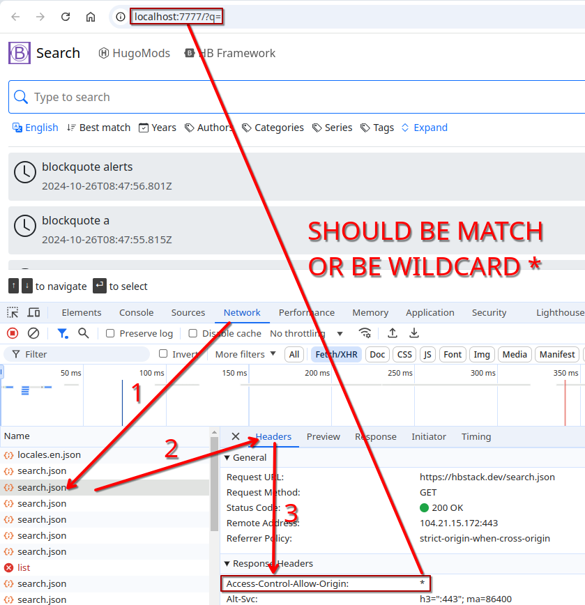

## Motivations

It's designed for client-side, cross sites searching.

## Live Demo

Check out the live demo on [here](https://theme-search.hbstack.dev/).

## Installation

### Clone the Template



### Change Directory



### Start Server

To start Hugo server, you can either using Docker Compose or native tools.

#### Start Server via Docker Compose

The template ships with a Docker Compose configuration, it's recommended if you have Docker installed on your environment.



#### Start Server via Native Tools

Please make sure you've installed the [build tools]().



## Search Indices

The theme itself doesn't ships with content, it loads search index from other sites, so you have to generate search indices for your sites.

### Generate Search Indices

> [!IMPORTANT]
> Please note that, this step should be performed on your site, not the search site.

#### Install Search Index Module

You can either install the search index module via Hugo Modules or Git Submodule.

##### Install Search Index Module as a Hugo Module

This approach is recommended if you have setup Hugo Modules.



##### Install Search Index Module as a Git Submodule

Install it via Git submodule, and then append the `search-index` into `theme`.



#### Setup the `SearchIndex` Home Output

To tell Hugo to generate search index, you'll need to append the `SearchIndex` into `outputs.home`.

You should be able access search index on `/search.json`.



#### Hugo Server Headers (Optional)

You'll need to configure Hugo server CORS headers if you want to test it on local environment.



### Add Search Indices

Back to the search site, once you've prepared the search index, it's time to add it to the `search.indices` parameter located in `config/_default/params.yaml`.

## What's Next?

1. Tweak the configuration located on `config` folder.
2. [Deploy the site]().

## Troubleshooting

### Failed to initialize index

If you encountered this issue, please:

1. Make sure the search index URL is correct.
2. Make sure the `Access-Control-Allow-Origin` response header is correct.

> [!TIP]
> You can find detailed error on developer console, you can press <kbd>F12</kbd> and switch the `Console` tab on Chrome.

### Blocked by CORS Policy

You may see the following similar errors if the search index does not respond correct `Access-Control-Allow-Origin` header.

1. No `Access-Control-Allow-Origin` header is present.
2. The `Access-Control-Allow-Origin` header contains the invalid value.

### How to Check CORS Header?

Turn on the browser developer tools, take Chrome (press `F12`) as an example.

### Other Issues

Please feel free to [ask questions on GitHub](https://github.com/orgs/hbstack/discussions/new?category=q-a).
